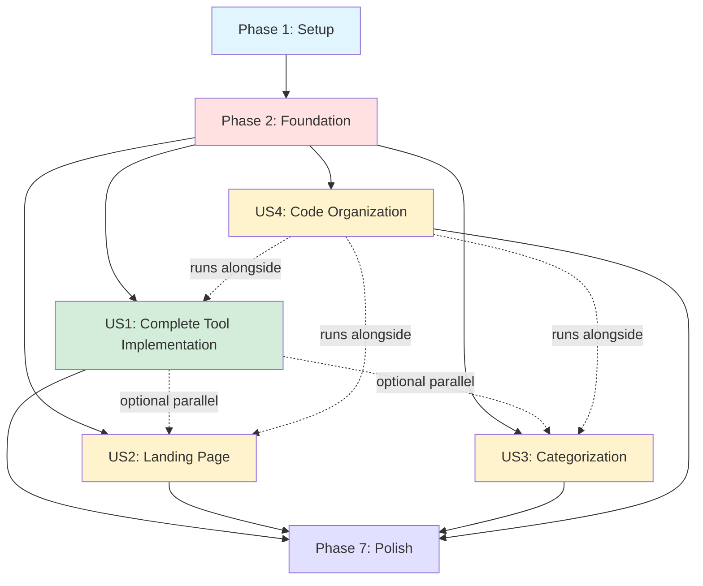

# Tasks: UI Enhancement and User Flow Optimization

**Feature**: 002-enhance-user-flow  
**Input**: Design documents from `/specs/002-enhance-user-flow/`  
**Prerequisites**: plan.md ✅, spec.md ✅, research.md ✅, data-model.md ✅, contracts/ ✅, quickstart.md ✅

**Generated**: February 3, 2026

---

## Format: `- [ ] [ID] [P?] [Story] Description`

- **[P]**: Can run in parallel (different files, no dependencies)
- **[Story]**: Which user story this task belongs to (US1, US2, US3, US4)
- File paths are absolute from repository root

---

## Phase 1: Setup (Shared Infrastructure)

**Purpose**: Project initialization and dependency installation

- [X] T001 Install shadcn/ui tabs component via CLI: `npx shadcn@latest add tabs`
- [X] T002 Install shadcn/ui select component via CLI: `npx shadcn@latest add select`
- [X] T003 Install shadcn/ui label component via CLI: `npx shadcn@latest add label`
- [X] T004 Install shadcn/ui input component via CLI: `npx shadcn@latest add input`
- [X] T005 Install shadcn/ui textarea component via CLI: `npx shadcn@latest add textarea`
- [X] T006 Install shadcn/ui toast component via CLI: `npx shadcn@latest add toast`
- [X] T007 Delete duplicate src/prompts folder: `rm -rf src/prompts`
- [X] T008 Verify TypeScript compilation: `pnpm tsc --noEmit`

**Checkpoint**: All shadcn components installed, duplicate prompts removed, no TypeScript errors

---

## Phase 2: Foundational (Blocking Prerequisites)

**Purpose**: Core infrastructure that MUST be complete before user story implementation

**⚠️ CRITICAL**: No user story work can begin until this phase is complete

- [X] T009 Create BaseCard component in src/components/cards/base-card.tsx with grain texture overlay, gradient border effect, hover glow transitions (opacity 0→1, scale 0.95→1, 300ms duration)
- [X] T010 Create Zod validation schemas in src/lib/validation/tool-input-schemas.ts for client-side input validation (prompt text, file sizes, file types, API parameters)
- [X] T011 Create server-side validation utilities in src/lib/validation/server-validators.ts for sanitizing user input and preventing injection attacks
- [X] T012 Update i18n message files (src/messages/en.json, src/messages/ru.json, src/messages/ar.json) with category names, filter UI text, common form labels, error messages (timeout, validation, generation failed)

**Checkpoint**: Foundation ready - BaseCard component working, validation layer complete, i18n keys added

---

## Phase 3: User Story 1 - Complete Tool Implementation with Consistent UI (Priority: P1) 🎯 MVP

**Goal**: All six tools display on tools page with consistent cards and have functional dedicated pages

**Independent Test**: Navigate to /tools and verify all 6 tools displayed with proper cards. Click each tool to verify dedicated page loads with variant selector and form components.

### Card Refactoring (Use BaseCard)

- [X] T013 [P] [US1] Refactor ToolCard component in src/components/cards/tool-card.tsx to compose BaseCard wrapper with tool-specific content (icon, name, description, category badge, variant count)
- [X] T014 [P] [US1] Refactor VariantCard component in src/components/cards/variant-card.tsx to compose BaseCard wrapper with variant-specific content (icon, name, description, selection state)
- [X] T015 [US1] Update tools list page in src/app/[locale]/tools/page.tsx to display all 6 tools using refactored ToolCard components in responsive grid (grid-cols-1 md:grid-cols-2 lg:grid-cols-3)

### Shared Tool Page Layout

- [X] T016 [US1] Create ToolPageLayout component in src/components/tools/tool-page-layout.tsx with header section (tool name, description, back button), variant selector placeholder, form area placeholder, generation controls (generate/cancel/retry buttons)
- [X] T017 [US1] Create AbortController timeout utility in src/lib/utils/timeout.ts with 15-second timeout, retry button handler, and cancel button handler

### Story Creator Tool Page

- [X] T018 [US1] Create StoryCreatorForm component in src/components/tools/story-creator-form.tsx with variant selector (tabs for 4 variants: General, TikTok, Reels, Short), topic input field with Zod validation, tone select field, length select field
- [X] T019 [US1] Update Story Creator page in src/app/[locale]/tools/story-creator/page.tsx to use ToolPageLayout with StoryCreatorForm, implement generation handler with AbortController timeout, loading state using LoadingState component, output display area
- [X] T020 [US1] Add server-side validation to Story Creator API route in src/app/api/generate/route.ts to re-validate inputs with Zod, sanitize user text, return 400 Bad Request on validation failure

### Post Creator Tool Page

- [X] T021 [P] [US1] Create PostCreatorForm component in src/components/tools/post-creator-form.tsx with platform select field (VK/Facebook/Dzen - no variant selector needed since variants:[] in config), topic textarea field, language select field, tone select field per src/config/tools/post-creator.ts
- [X] T022 [US1] Update Post Creator page in src/app/[locale]/tools/post-creator/page.tsx to use ToolPageLayout with PostCreatorForm, implement generation handler with AbortController, loading and output states
- [X] T023 [US1] Add server-side validation to Post Creator in unified API route src/app/api/generate/route.ts (handles all tools) - re-validate inputs with Zod, sanitize user text, return 400 Bad Request on validation failure

### Scene Creator Tool Page

- [X] T024 [P] [US1] Create SceneCreatorForm component in src/components/tools/scene-creator-form.tsx with variant selector (tabs for 2-3 variants), image upload component (reuse existing src/components/tools/image-upload.tsx), scene description textarea with Zod validation
- [X] T025 [US1] Update Scene Creator page in src/app/[locale]/tools/scene-creator/page.tsx to use ToolPageLayout with SceneCreatorForm, implement generation handler with file upload support and AbortController
- [X] T026 [US1] Add server-side validation to Scene Creator in unified API route src/app/api/generate/route.ts for image file validation (file type, size limits) and text sanitization

### Quote Generator Tool Page

- [X] T027 [P] [US1] Create QuoteGeneratorForm component in src/components/tools/quote-generator-form.tsx with variant selector (tabs for 2-3 variants), topic input field, style select field, mood select field
- [X] T028 [US1] Update Quote Generator page in src/app/[locale]/tools/quote-generator/page.tsx to use ToolPageLayout with QuoteGeneratorForm, implement generation handler with AbortController
- [X] T029 [US1] Add server-side validation to Quote Generator in unified API route src/app/api/generate/route.ts to re-validate inputs with Zod, sanitize user text, return 400 Bad Request on validation failure

### Reels Creator Tool Page

- [X] T030 [P] [US1] Create ReelsCreatorForm component in src/components/tools/reels-creator-form.tsx with variant selector (tabs for 2-3 variants), topic input field, duration select field, style select field
- [X] T031 [US1] Update Reels Creator page in src/app/[locale]/tools/reels-creator/page.tsx to use ToolPageLayout with ReelsCreatorForm, implement generation handler with AbortController
- [X] T032 [US1] Add server-side validation to Reels Creator in unified API route src/app/api/generate/route.ts to re-validate inputs with Zod, sanitize user text, return 400 Bad Request on validation failure

### Scene Mood Describer Tool Page

- [X] T033 [P] [US1] Create SceneMoodDescriberForm component in src/components/tools/scene-mood-describer-form.tsx with variant selector (tabs for 1-2 variants), image upload component, analysis depth select field
- [X] T034 [US1] Update Scene Mood Describer page in src/app/[locale]/tools/scene-mood-describer/page.tsx to use ToolPageLayout with SceneMoodDescriberForm, implement generation handler with file upload and AbortController
- [X] T035 [US1] Add server-side validation to Scene Mood Describer in dedicated API route src/app/api/analyze-scene-mood/route.ts for image validation (file type, size limits) and text sanitization

### Testing & Polish

- [X] T036 [US1] Test all 6 tool pages: verify variant selectors render correctly (tabs for 2-4, dropdown for 5+), form validation works, generation succeeds, loading states display, 15s timeout triggers error with retry button, cancel button aborts generation
- [X] T037 [US1] Verify no console errors, all TypeScript types correct, no duplicate styling code across card components

**Story Completion**: All 6 tools accessible with consistent UI, functional generation workflows, proper error handling

---

## Phase 4: User Story 2 - Enhanced Landing Page Experience (Priority: P2)

**Goal**: Landing page features 2 prominent tools (Story Creator, Post Creator) with compelling preview cards and smooth animations

**Independent Test**: Load home page and verify hero section clarity, 2 featured tool previews with proper styling, animations smooth, "Explore Tools" CTA prominent and functional

- [X] T038 [US2] Create FeaturedToolCard component in src/components/cards/featured-tool-card.tsx composing BaseCard with larger dimensions (h-[500px]), enhanced glow effects (opacity 0.4 on hover), promotional styling overrides, scale + rotate animation on hover
- [X] T039 [US2] Update landing page in src/app/[locale]/page.tsx with hero section (platform title, subtitle, "Explore Tools" CTA button with retro-shadow styling), featured tools section with 2 FeaturedToolCards (Story Creator, Post Creator), FadeIn animations with staggered delays (100ms between cards)
- [X] T040 [US2] Verify landing page animations: test scroll-triggered FadeIn animations (opacity 0→1, scale 0.95→1, 300ms), hover states on featured cards, responsive layout on mobile (cards stack vertically), CTA button links to /tools page

**Story Completion**: Landing page provides compelling first impression with clear value proposition and featured tools

---

## Phase 5: User Story 3 - Tool Categorization and Navigation (Priority: P3)

**Goal**: Users can browse tools by category with clear visual grouping and filtering on tools page

**Independent Test**: Navigate to tools page, verify category filter tabs/controls visible, clicking categories filters tools correctly, category badges visible on cards, URL updates with ?category= parameter

- [X] T041 [US3] Create CategoryFilter component in src/components/tools/category-filter.tsx with tabs UI (@radix-ui/react-tabs) for 4 options (All Tools, Content Creation, Image Analysis, Social Media), badge indicators showing tool count per category, client-side filtering with useSearchParams hook
- [X] T042 [US3] Update category badge rendering in ToolCard component (src/components/cards/tool-card.tsx) to display small uppercase label in top-right corner with category-specific accent colors (Content Creation: amber, Image Analysis: blue, Social Media: purple)
- [X] T043 [US3] Update tools list page (src/app/[locale]/tools/page.tsx) to integrate CategoryFilter component, implement client-side filtering logic based on searchParams ?category= value, update URL on category change via router.replace(), render filtered tool list with smooth framer-motion transitions (300ms opacity + scale)
- [X] T044 [US3] Create empty state component in src/components/tools/empty-state.tsx for zero-results UI with "No tools found in [Category]" message, lucide-react icon (SearchX or PackageOpen), "Clear filters" button linking to /tools (removes ?category= param), "View All Tools" button as alternative
- [X] T045 [US3] Add empty state rendering logic to tools page when filtered array is empty, ensure animations smooth when transitioning between filtered states
- [X] T046 [US3] Test category filtering: click each category tab, verify correct tools display, verify URL updates (shareable), verify empty state when filtering returns zero results, verify "Clear filters" button works, test mobile responsive layout

**Story Completion**: Users can efficiently browse tools by category with clear visual feedback and shareable filtered URLs

---

## Phase 6: User Story 4 - Code Organization and Component Refactoring (Priority: P3)

**Goal**: Clean, maintainable codebase with unified card components, no duplicate styling code, shadcn components installed

**Independent Test**: Verify src/prompts deleted, BaseCard used by all cards, shadcn components functional, no duplicate styling in card files, TypeScript compilation clean

- [X] T047 [US4] Verify BaseCard component is imported and composed by ToolCard, VariantCard, and FeaturedToolCard components (no duplicate styling logic)
- [X] T048 [US4] Verify src/prompts folder is deleted and only /prompts root folder exists with multi-language support (en/ru/ar)
- [X] T049 [US4] Test shadcn/ui components functionality: tabs component in variant selectors, select component in form dropdowns (5+ variants), label/input/textarea components in tool forms, toast component for success/error notifications
- [X] T050 [US4] Run TypeScript type check (`pnpm tsc --noEmit`) and verify zero errors across all new and refactored components
- [X] T051 [US4] Test card styling consistency: verify all cards use same grain texture overlay, gradient borders, hover glow effects (300ms transitions), responsive scaling, dark theme compliance
- [X] T052 [US4] Verify modifying BaseCard component styling automatically applies to all three card variants (test by temporarily changing grain opacity in BaseCard and checking all card types reflect change)

**Story Completion**: Codebase is clean and maintainable with unified component architecture and zero technical debt from this feature

---

## Phase 7: Polish & Cross-Cutting Concerns

**Purpose**: Final integration testing, performance validation, cross-cutting improvements

### Concurrent Interaction Handling

- [X] T053 Implement variant switching during active generation: update all tool form components to detect variant change during isGenerating=true state, abort in-flight request via AbortController, update selectedVariant state, reset form to idle (require manual "Generate" click for new generation)
- [X] T054 Test concurrent interaction scenario: start generation on one variant, switch to different variant mid-generation, verify request aborted, verify UI resets to idle state, verify user must click Generate again

### Mobile Responsive Testing

- [X] T055 Test landing page on mobile (375px width): hero section readable, featured cards stack vertically, CTA button properly sized (44x44px minimum touch target), animations smooth
- [X] T056 Test tools page on mobile: grid collapses to single column (grid-cols-1), category filter tabs wrap or scroll horizontally, tool cards readable, touch targets properly sized
- [X] T057 Test tool detail pages on mobile: variant selector accessible (tabs scrollable if needed), form inputs full width, generate button full width and properly sized, output area readable

### Performance Validation

- [X] T058 Measure page load times: landing page <2s, tools page <2s, tool detail pages <2s on standard broadband
- [X] T059 Verify animations run at 60fps: test FadeIn animations on landing page, test category filter transitions, test card hover animations
- [X] T060 Verify no console errors or warnings in browser DevTools across all pages

### Security Testing

- [X] T061 Test client-side Zod validation: submit forms with invalid inputs (empty required fields, text too short, invalid file types), verify inline error messages display with actionable guidance
- [X] T062 Test server-side validation: bypass client validation via API calls with malformed data, verify 400 Bad Request responses, verify error messages don't expose internal system details, verify malicious input attempts are logged for security monitoring
- [X] T063 Test XSS prevention: submit user input with script tags, verify output is properly sanitized and not executed

### Internationalization Testing

- [X] T064 Test English locale: verify all UI text displays correctly, verify tool descriptions and labels use en.json translations
- [X] T065 Test Russian locale: switch to /ru, verify all UI text translates, verify Cyrillic characters render properly
- [X] T066 Test Arabic locale with RTL: switch to /ar, verify RTL layout for entire UI, verify category filter tabs render right-to-left, verify Arabic text displays properly

### Success Criteria Validation

- [X] T067 Validate SC-001: Test navigation from landing page to any tool page, verify ≤3 clicks (Home → Explore Tools → Tool Card → Tool Page)
- [X] T068 Validate SC-002: Load all pages, verify no console errors related to missing dependencies or components
- [X] T069 Validate SC-003: Test hover states on all interactive elements (buttons, cards, links), verify 100% have proper visual feedback
- [X] T070 Validate SC-004: Test all features on 375px mobile viewport, verify readable text and 44x44px touch targets
- [X] T071 Validate SC-005: Measure page load times on standard broadband, verify all <2s with complete rendering
- [X] T072 Validate SC-006: Review package.json dependencies, verify zero new npm packages installed (only shadcn source files added)
- [X] T073 Validate SC-007: Execute end-to-end tool generation workflows for all 6 tools, track success rate, verify ≥95% success rate

---

## Dependencies Between User Stories

**Dependency Rules**:
- **Setup → Foundation**: Must complete sequentially (Foundation needs shadcn components from Setup)
- **Foundation → User Stories**: Foundation MUST complete before ANY user story work begins
- **US1-US4 Parallel Execution**: After Foundation, all user stories can be implemented in parallel (they touch different files)
- **US4 Alongside Others**: US4 (Code Organization) is verified alongside other stories (refactoring validation)
- **Polish After All Stories**: Final phase runs only after all user stories complete

---

## Parallel Execution Opportunities

### Within User Story 1 (Complete Tool Implementation)

**Batch 1 - Card Refactoring** (parallel, different files):
- T013: ToolCard refactoring
- T014: VariantCard refactoring

**Batch 2 - Tool Form Components** (parallel, different files):
- T018: StoryCreatorForm component
- T021: PostCreatorForm component
- T024: SceneCreatorForm component
- T027: QuoteGeneratorForm component
- T030: ReelsCreatorForm component
- T033: SceneMoodDescriberForm component

**Batch 3 - Tool Page Integration** (sequential per tool, but tools are parallel):
- Tool 1: T019 → T020 (Story Creator)
- Tool 2: T022 → T023 (Post Creator)
- Tool 3: T025 → T026 (Scene Creator)
- Tool 4: T028 → T029 (Quote Generator)
- Tool 5: T031 → T032 (Reels Creator)
- Tool 6: T034 → T035 (Scene Mood Describer)

### Across User Stories (after Foundation complete)

**Parallel User Story Work**:
- US1 (T013-T037): Complete tool implementation
- US2 (T038-T040): Landing page enhancement
- US3 (T041-T046): Category filtering
- US4 (T047-T052): Code organization validation (runs alongside others)

---

## Implementation Strategy

### MVP First Approach (Recommended)

**MVP = User Story 1 (P1) ONLY**
- Delivers core value: All 6 tools functional with consistent UI
- Users can access and use every tool
- Estimated effort: ~60% of total feature work
- Deliverable: Functional tool platform with complete UI

**Post-MVP Incremental Delivery**:
1. **Increment 1**: Add US2 (Landing Page) - improves first-time user experience
2. **Increment 2**: Add US3 (Categorization) - improves returning user experience
3. **Increment 3**: Add US4 (Code Organization) - technical debt cleanup

### Full Feature Approach (Alternative)

Complete all phases sequentially:
1. Phase 1 (Setup): ~5% effort
2. Phase 2 (Foundation): ~15% effort
3. Phase 3 (US1): ~40% effort
4. Phase 4 (US2): ~10% effort
5. Phase 5 (US3): ~15% effort
6. Phase 6 (US4): ~5% effort
7. Phase 7 (Polish): ~10% effort

---

## Task Summary

**Total Tasks**: 73

**By Phase**:
- Phase 1 (Setup): 8 tasks
- Phase 2 (Foundation): 4 tasks
- Phase 3 (US1 - Complete Tool Implementation): 25 tasks
- Phase 4 (US2 - Landing Page): 3 tasks
- Phase 5 (US3 - Categorization): 6 tasks
- Phase 6 (US4 - Code Organization): 6 tasks
- Phase 7 (Polish & Testing): 21 tasks

**By User Story**:
- US1 (P1 - Complete Tool Implementation): 25 tasks ⭐ MVP
- US2 (P2 - Landing Page): 3 tasks
- US3 (P3 - Categorization): 6 tasks
- US4 (P3 - Code Organization): 6 tasks
- Setup + Foundation: 12 tasks
- Cross-cutting (Polish): 21 tasks

**Parallel Opportunities**:
- 8 tasks marked [P] can run in parallel within their phase
- All 4 user stories can be implemented in parallel after Foundation completes
- 6 tool form components can be created simultaneously (T018, T021, T024, T027, T030, T033)

**Independent Testing**:
- Each user story has clear acceptance criteria and can be tested independently
- US1 provides complete tool functionality (MVP deliverable)
- US2 enhances landing page without affecting tool functionality
- US3 adds filtering without changing tool implementations
- US4 validates code quality without changing functionality

---

## Format Validation ✅

All tasks follow required checklist format:
- ✅ Checkbox: `- [ ]` present on all tasks
- ✅ Task ID: Sequential T001-T073
- ✅ [P] marker: Present on 8 parallelizable tasks
- ✅ [Story] label: Present on all user story tasks (US1-US4)
- ✅ Description: Clear action with exact file path
- ✅ No story label: Setup, Foundation, and Polish phases (as required)

**Example valid formats from this file**:
- `- [ ] T001 Install shadcn/ui tabs component via CLI: npx shadcn@latest add tabs` (Setup, no story label)
- `- [ ] T013 [P] [US1] Refactor ToolCard component in src/components/cards/tool-card.tsx...` (P + Story)
- `- [ ] T019 [US1] Update Story Creator page in src/app/[locale]/tools/story-creator/page.tsx...` (Story only)
